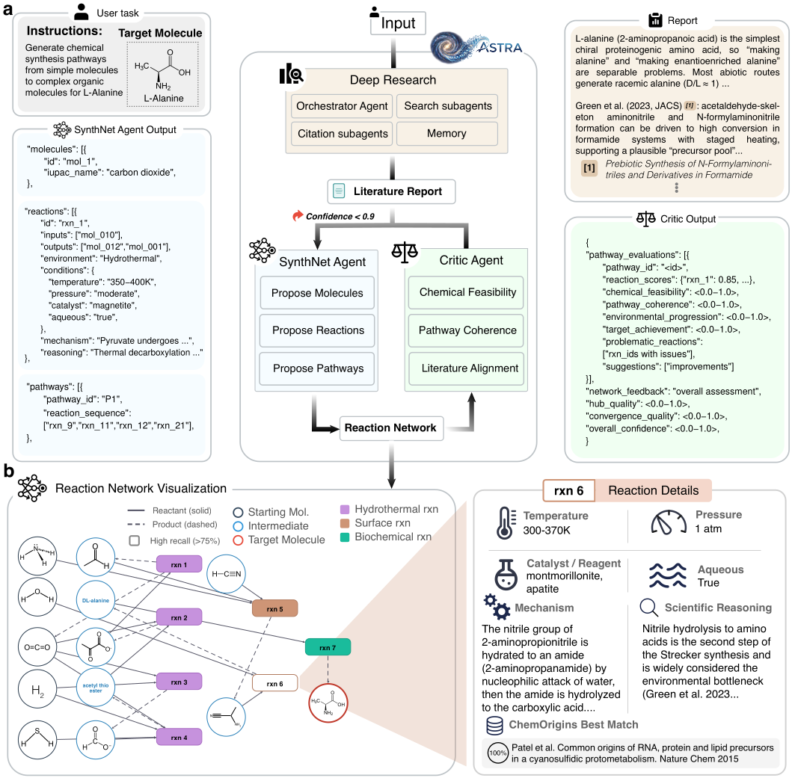
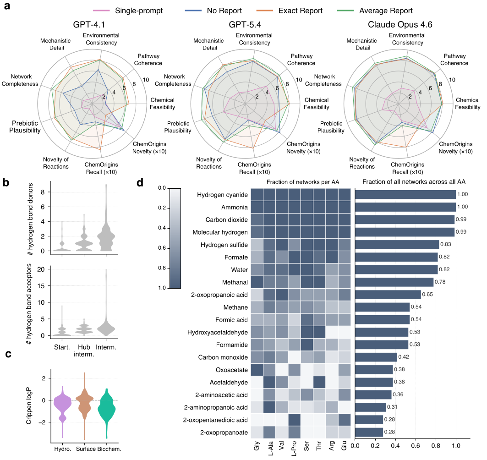
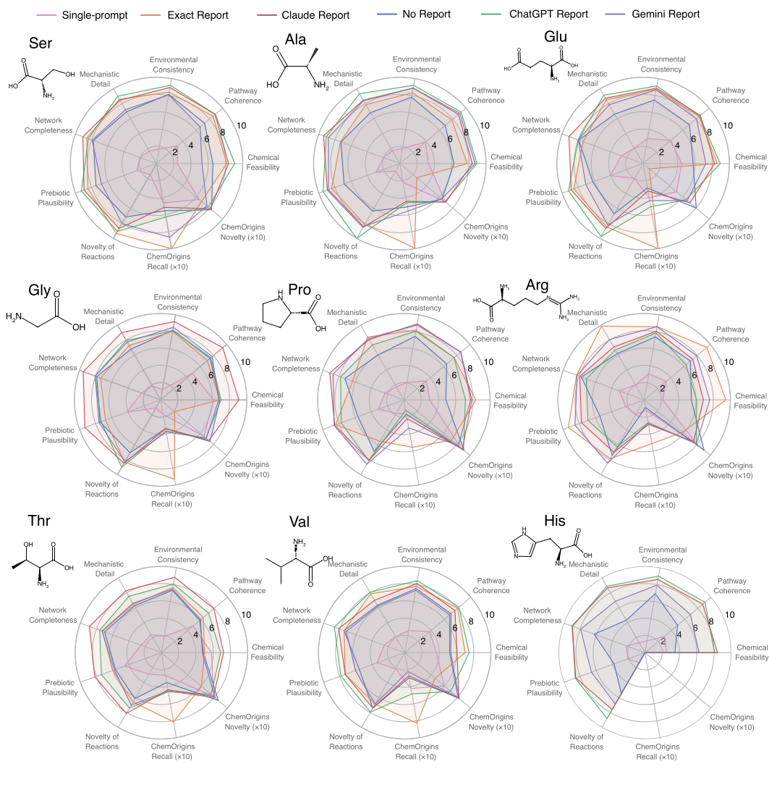
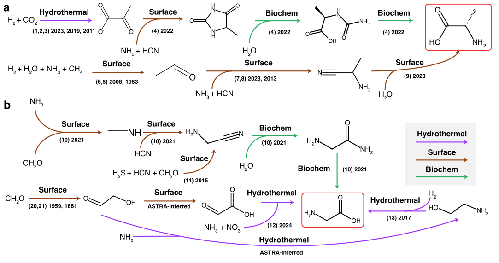
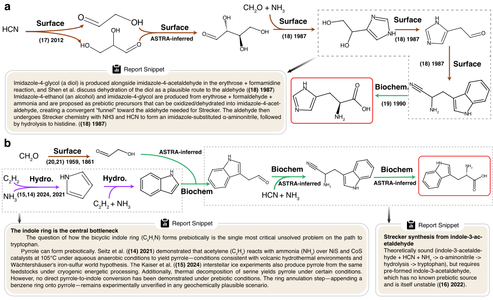

<p align="center">
  
</p>

<h1 align="center">ASTRA</h1>

<p align="center">
  <b>Autonomous Multi-Agent Reconstruction of Prebiotic Reaction Networks<br>
  Reveals Organizational Features of Amino Acid Synthesis</b>
</p>

<p align="center">
  <a href="https://chemrxiv.org/doi/abs/10.26434/chemrxiv.15005927/v1">
    
  </a>
  
  
</p>

---

**ASTRA** is a multi-agent system that reconstructs **chemical synthesis networks** connecting simple
prebiotic feedstocks (H₂O, CO₂, NH₃, HCN, H₂CO, H₂S, CH₄, H₂) to complex biomolecules such as amino
acids. A `SynthesisNetworkAgent` proposes a complete, multi-pathway reaction network for a target
molecule; a `CriticAgent` scores it for chemical feasibility, pathway coherence, environmental
consistency, and literature alignment; and an optional deep-research / RAG stage grounds both agents
in the origins-of-life literature. Generated networks are then validated against the curated
**ChemOrigins** reference dataset.

The repository doubles as an **ablation study**: it measures how different research-context sources
(Deep Research from Claude / ChatGPT / Gemini, MS Discovery, Perfect RAG, or none) and different LLM
backends (Claude Opus, GPT-4.1, GPT-5.4) affect the quality of the reconstructed networks.

<p align="center">
  
</p>

<p align="center"><i>
  ASTRA pipeline: a target molecule and a literature report feed the SynthNet and Critic agents,
  which iterate until confidence ≥ threshold, producing an environment-tagged reaction network with
  full per-reaction chemical detail.
</i></p>

## Highlights

- **Single-shot network generation** — one agent call emits a complete `SynthesisNetwork` (molecules,
  reactions, and pathways), rather than a step-by-step search.
- **Critic-in-the-loop** — networks are re-generated with feedback until the critic's confidence
  crosses a threshold.
- **Environment-grounded chemistry** — every reaction is tagged with a prebiotic environment
  (Hydrothermal, Surface, or Biochemical) and annotated with temperature, pressure, catalyst,
  mechanism, and scientific reasoning.
- **Pluggable LLM backends** — Claude Opus, GPT-4.1, and GPT-5.4 selectable via a single env var.
- **Reproducible validation** — networks are matched reaction-by-reaction against ChemOrigins
  reference data with RDKit/InChI similarity, yielding precision and recall.

## Installation

```bash
git clone <this-repo-url>
cd astra
python -m venv .venv && source .venv/bin/activate   # optional but recommended
pip install -r requirements.txt
```

Dependencies include `autogen-agentchat`/`autogen-ext` (0.4.x), `rdkit`, `drfp`, `anthropic`,
`openai`, and `google-generativeai`. Python 3.10+ is recommended.

### Configure credentials

All credentials live in [`config.env`](config.env). You only need the keys for the backend you
select — the others can stay as placeholders. Set `MODEL_PROVIDER` to the model that should build
the networks:

```ini
# config.env
MODEL_PROVIDER=claude          # claude | gpt41 | gpt5.4_openai | gpt5.4_agent_azure

ANTHROPIC_API_KEY=sk-ant-...   # required when MODEL_PROVIDER=claude
CLAUDE_MODEL=claude-opus-4-6
```

| `MODEL_PROVIDER` | Backend | Required keys |
|---|---|---|
| `claude` | Anthropic Claude Opus | `ANTHROPIC_API_KEY` |
| `gpt41` | Azure OpenAI GPT-4.1 | `AZURE_GPT41_*` |
| `gpt5.4_openai` | OpenAI GPT-5.4 (Responses API) | `OPENAI_DIRECT_*` |
| `gpt5.4_agent_azure` | Azure AI Projects agent (GPT-5.4) | `AZURE_AGENT_*` |

## Quick Start (notebook)

The fastest way to generate your first network is [`QuickStart.ipynb`](QuickStart.ipynb). It walks
through the full generation flow interactively — you supply the deep-research context yourself from a
chat assistant, so **no research API keys are required** (only the key for your chosen
`MODEL_PROVIDER`):

```bash
jupyter lab QuickStart.ipynb     # or: jupyter notebook
```

The notebook takes you through five steps:

1. **Pick a target molecule** — any common or IUPAC name (`Glycine`, `L-Alanine`, `Serine`, …).
2. **Collect deep research** — the notebook prints a ready-to-copy prompt; run it in the
   *Deep Research / Research* mode of **Claude.ai**, **Gemini**, or **ChatGPT**.
3. **Paste the markdown answer** back into the notebook.
4. **Run the ASTRA pipeline** — SynthNet proposes a network, the Critic scores it (up to
   `MAX_RETRIES` cycles).
5. **Inspect the results** — the reconstructed network JSON and its confidence score.

Generated networks are written to `outputs/quickstart/`.

## Full pipeline (CLI)

For batch / ablation experiments, use [`pipeline.py`](pipeline.py). It has three stages that chain
end-to-end, with output routed per provider (`outputs/{provider}/` → `outputs_inchi_corrected/{provider}/`
→ `validation_report/{provider}/`). Every stage auto-resumes, skipping already-completed
`(molecule, config, run)` combinations.

```bash
# 1) Generate synthesis networks
python pipeline.py generate --molecules L-Alanine,Glycine --runs 3 --provider claude

# 2) Backfill canonical InChI from PubChem
python pipeline.py inchi --provider claude

# 3) Validate networks against ChemOrigins reference data
python pipeline.py validate --provider claude

# ...or run all three stages in sequence for one provider:
python pipeline.py all --molecules L-Alanine --provider claude

# per-stage flags:
python pipeline.py generate --help
```

Useful `generate` flags: `--configs` (which research-context ablation to run), `--runs`,
`--num-pathways`, `--confidence-threshold`, `--max-retries`. See [`CLAUDE.md`](CLAUDE.md) for the
full architecture and output-layout reference.

## How it works

ASTRA grounds every reaction in one of three prebiotic environments from the ChemOrigins framework:

- **Hydrothermal** (deep-sea alkaline vents) — 350–600 K, high pressure, iron-sulfur catalysis; CO₂
  reduction, reductive amination, pyruvate synthesis.
- **Surface** (evaporitic pools & geothermal fields) — 300–370 K, wet-dry cycles, UV; Strecker
  synthesis, HCN oligomerization, cyanosulfidic pathways.
- **Biochemical** (prebiotic assembly) — peptide/nucleotide assembly and proto-metabolic cycles that
  stitch hydrothermal and surface products into biomolecules.

## Results

ASTRA reconstructs literature-supported synthesis routes across the standard amino acids and, in
several cases, proposes chemically plausible **ASTRA-inferred** links that fill gaps between known
steps.

<p align="center">
  
</p>

<p align="center"><i>
  (a) Expert-metric radar profiles across three LLM backends and four research-context conditions.
  (b–c) Physicochemical structure of the reconstructed networks — hydrogen-bond donors/acceptors and
  Crippen logP across starting, hub, intermediate, and per-environment molecules.
  (d) Feedstock usage across the reconstructed amino-acid networks.
</i></p>

<p align="center">
  
</p>

<p align="center"><i>
  Per-amino-acid evaluation profiles comparing single-prompt baselines against report-grounded runs
  (Exact, Claude, ChatGPT, Gemini, and No Report).
</i></p>

<p align="center">
  
</p>

<p align="center"><i>
  Reconstructed multi-environment routes to <b>alanine</b> (a) and <b>glycine</b> (b), with each step
  tagged by environment and annotated with supporting citations; purple = hydrothermal,
  brown = surface, green = biochemical.
</i></p>

<p align="center">
  
</p>

<p align="center"><i>
  Reconstructed routes to <b>histidine</b> (a) and <b>tryptophan</b> (b). Report snippets show how
  ASTRA identifies and reasons about the key synthetic bottlenecks (e.g., prebiotic formation of the
  indole ring).
</i></p>

## Citation

If you use ASTRA in your research, please cite:

```bibtex
@article{saeedi2026astra,
  title   = {Autonomous Multi-Agent Reconstruction of Prebiotic Reaction Networks
             Reveals Organizational Features of Amino Acid Synthesis},
  author  = {Saeedi, Daniel and Pokhrel, Nihit and Gao, Leijia and Wen, Charley and
             Bruce, Elizabeth and Aponte, Jos{\'e} C. and Stockton, Amanda and
             Aghazadeh, Amirali},
  journal = {ChemRxiv},
  year    = {2026},
  doi     = {10.26434/chemrxiv.15005927/v1},
  url     = {https://chemrxiv.org/doi/abs/10.26434/chemrxiv.15005927/v1}
}
```

## Authors

- **Daniel Saeedi**¹ · **Amirali Aghazadeh**¹ (corresponding, `amiralia@gatech.edu`)
- Nihit Pokhrel² · Leijia Gao² · Charley Wen² · Elizabeth Bruce²
- José C. Aponte³
- Amanda Stockton⁴

<sup>1 — School of Electrical and Computer Engineering, Georgia Institute of Technology ·
2 — Microsoft Discovery ·
3 — Astrochemistry Laboratory, NASA Goddard Space Flight Center ·
4 — School of Chemistry and Biochemistry, Georgia Institute of Technology</sup>
